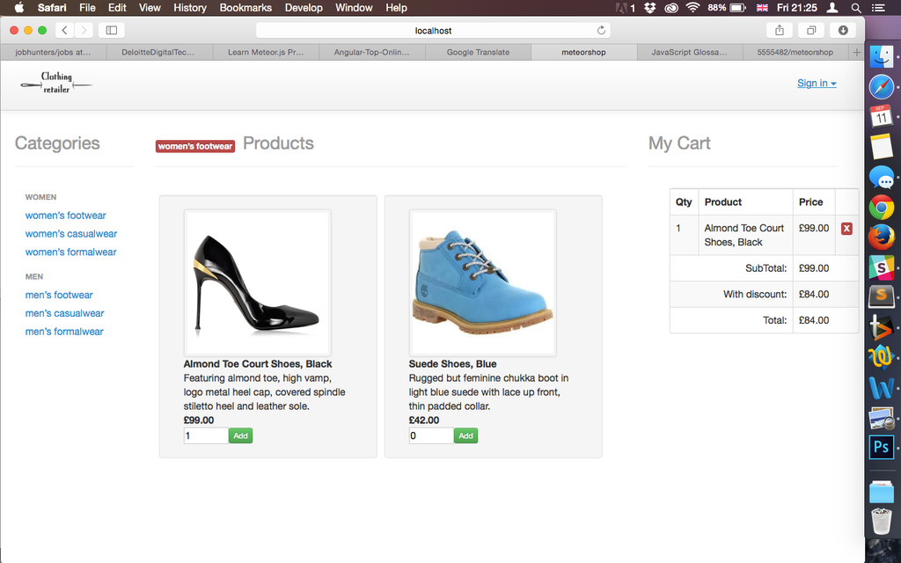

#Responsive web site for a clothing retailer.



###Task

* Following user stories:

```
As a User I can add a product to my shopping cart.

As a User I can remove a product from my shopping cart.

As a User I can view the total price for the products in my shopping cart.

As a User I can apply a voucher to my shopping cart.

As a User I can view the total price for the products in my shopping cart with discounts applied.

As a User I am alerted when I apply an invalid voucher to my shopping cart.

As a User I am unable to Out of Stock products to the shopping cart.

```

##To run the app:

Please make sure that you have meteor installed: 
```
curl https://install.meteor.com/ | sh 
```

Then:
```
git clone https://github.com/5555482/meteorshop.git
cd meteorshop
$ meteor
Then navigate to http://localhost:3000
```
* The retailer sells six different categories of clothes:
```
 women’s footwear
 
 men’s footwear
 
 women’s casualwear
 
 men’s casualwear
 
 women’s formalwear 
 
 men’s formalwear
 
```

* There are also discount vouchers availabls:
```
£5.00 off your order

£10.00 off when you spend over £50.00

£15.00 off when you have bought at least one footwear item and spent over £75.00
```
##Approach:

I saw someone write: “Meteor is to Node.js as Rails is to Ruby.” and I think that’s a good time for trying new framework.
Meteor has real-time built into its core though. When the database is updated, the data in your templates is updated. When a user clicks a button or submits a form, the action occurs immediately. In the vast majority of cases, this doesn’t even require any extra effort. You build a web application as you normally would and, out of the box, it just happens to be real-time.

